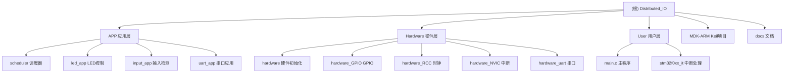

# Distributed_IO - STM32F0 嵌入式项目

> 最后更新：2026-01-30 14:55:23

## 项目愿景

这是一个基于 STM32F051 微控制器的分布式 I/O 控制系统，实现了时间片调度器、RS485 通信、LED 阵列控制和输入检测等功能。项目采用标准外设库开发，使用 Keil MDK-ARM 作为主要开发环境。

## 架构总览

项目采用分层架构设计：

- **应用层 (APP/)**：业务逻辑和任务实现
- **硬件抽象层 (Hardware/)**：外设驱动封装
- **用户层 (User/)**：主程序和中断处理
- **标准外设库**：STM32F0xx 固件库
- **CMSIS**：ARM Cortex-M0 核心支持

## 模块结构图



## 模块索引

| 模块路径 | 职责 | 语言 | 入口文件 |
|---------|------|------|---------|
| `APP/` | 应用层业务逻辑 | C | `scheduler.c` |
| `Hardware/` | 硬件抽象层 | C | `hardware.c` |
| `User/` | 主程序和中断 | C | `main.c` |
| `docs/` | 项目文档 | Markdown | - |
| `MDK-ARM/` | Keil 项目配置 | - | `Project.uvprojx` |

## 硬件规格参考

> 原理图位置: `C:\Users\Water21\Desktop\SCH_Schematic1_2026-01-30.pdf`

### 核心参数
| 项目 | 规格 |
|------|------|
| **MCU** | STM32F051R8T6 (LQFP64, Cortex-M0) |
| **Flash/RAM** | 64KB / 8KB |
| **电源** | +24V输入 → LDO → +3.3V |
| **通信** | RS485 (SP3485收发器) |
| **LED指示** | 16个LED (低电平点亮) |

### GPIO引脚分配（按代码配置）

#### LED指示灯 (低电平点亮，对应ucled[0-15])
| ucled索引 | GPIO引脚 | 说明 |
|-----------|----------|------|
| 0 | PC15 | LED1 |
| 1 | PC14 | LED2 |
| 2 | PC13 | LED3 |
| 3 | PB9 | LED4 |
| 4 | PB8 | LED5 |
| 5 | PB7 | LED6 |
| 6 | PB6 | LED7 |
| 7 | PB5 | LED8 |
| 8 | PB4 | LED9 |
| 9 | PB3 | LED10 |
| 10 | PD2 | LED11 |
| 11 | PC12 | LED12 |
| 12 | PC11 | LED13 |
| 13 | PC10 | LED14 |
| 14 | PA15 | LED15 |
| 15 | PF7 | LED16 |

#### RS485通信
| GPIO引脚 | 功能 | 说明 |
|----------|------|------|
| PA9 | USART1_TX | 发送数据 |
| PA10 | USART1_RX | 接收数据 |
| PA12 | USART1_DE | 硬件DE控制 |

#### 输入检测
| GPIO引脚 | 功能 | 说明 |
|----------|------|------|
| PB13 | 输入引脚 | 当前测试用 |

#### 调试接口
| MCU引脚 | 功能 | 连接器 |
|---------|------|--------|
| PA13/SWDIO | 调试数据 | SWD接口 |
| PA14/SWCLK | 调试时钟 | SWD接口 |
| NRST | 复位 | 复位电路 |
| PF0/OSC_IN | 晶振输入 | 8MHz |
| PF1/OSC_OUT | 晶振输出 | 8MHz |

### LED控制代码示例（标准库）

```c
// 点亮LED (低电平有效)
GPIO_WriteBit(GPIOC, GPIO_Pin_15, Bit_RESET);  // LED1亮
ucled[0] = 1;

// 熄灭LED
GPIO_WriteBit(GPIOC, GPIO_Pin_15, Bit_SET);    // LED1灭
ucled[0] = 0;

// 批量更新LED显示
led_disp(ucled);
```

### HAL库对比

```c
// HAL库方式
HAL_GPIO_WritePin(GPIOC, GPIO_PIN_15, GPIO_PIN_RESET);  // 亮
HAL_GPIO_WritePin(GPIOC, GPIO_PIN_15, GPIO_PIN_SET);    // 灭
```

## 运行与开发

### 编译环境
- **IDE**: Keil MDK-ARM (uVision 5)
- **编译器**: ARM Compiler
- **目标芯片**: STM32F051R8T6

### 编译步骤
1. 打开 `MDK-ARM/Project.uvprojx`
2. 选择目标配置 (STM32F051)
3. 点击 Build (F7) 编译项目
4. 点击 Download (F8) 烧录到板子

### 串口配置
- **波特率**: 115200
- **数据位**: 8
- **停止位**: 1
- **校验位**: 无
- **硬件流控**: 无

## 测试策略

当前项目处于开发阶段，主要测试方式为：

### 硬件在环测试
- LED 阵列显示测试（每秒翻转一次）
- 输入检测测试（PB13 引脚）
- RS485 通信测试（每秒发送 "Hello World"）
- 外部中断测试（PA8 引脚翻转 LED9）

### 调试方法
- 使用 Keil ULINK 进行在线调试
- 串口输出调试信息
- LED 状态可视化

## 编码规范

### 命名约定
- **文件名**: 小写下划线分隔，如 `hardware_uart.c`
- **函数名**: 小写下划线分隔，如 `uart_task()`
- **变量名**: 小写下划线分隔，如 `uart1_buffer`
- **宏定义**: 大写下划线分隔，如 `UART1_BUFFER_SIZE`

### 代码风格
- 缩进使用制表符
- 左大括号不换行
- 注释使用中文
- 函数必须有注释说明（@brief、@input、@return）

### 目录组织
```
Distributed_IO/
├── APP/           # 应用层代码
├── Hardware/      # 硬件抽象层
├── User/          # 主程序和中断
├── CMSIS/         # ARM 核心支持
├── Libraries/     # STM32 标准库
├── MDK-ARM/       # Keil 项目文件
└── docs/          # 项目文档
```

## AI 使用指引

> **重要：这是学习项目，回答时请遵循以下原则**

### 核心规则（必须遵守）

#### 代码修改前必须询问
**在修改任何代码文件之前，必须先获得用户明确同意！**

1. 先展示拟修改的代码内容
2. 说明修改原因和影响范围
3. 等待用户确认同意后才能执行修改
4. 仅修改用户明确同意的部分

**禁止行为**：
- ❌ 未经同意直接修改代码
- ❌ 批量修改多个文件时一次性全部修改
- ❌ 仅描述改动但不询问就直接执行

### 学习背景
- **产品类型**: 分布式IO产品（工业控制领域）
- **学习目标**: 从HAL库转向标准库，深入理解STM32底层原理
- **当前芯片**: STM32F051R8T6 (Cortex-M0, 64KB Flash, 8KB RAM)
- **学习路径**: 逐步验证各外设功能（GPIO、TIM、USART、ADC、SPI、I2C等）
- **既往经验**: 已掌握HAL库，现在学习标准外设库（SPL）

### 回答原则
1. **详细解答**: 不要只给代码，要解释原理和寄存器操作
2. **对比HAL库**: 当解释标准库函数时，说明对应的HAL库函数及其区别
3. **寄存器视角**: 尽可能展示底层寄存器配置，帮助理解硬件工作原理
4. **循序渐进**: 考虑到是学习过程，提供从简单到复杂的学习建议
5. **实用性**: 结合分布式IO产品的实际应用场景

### 标准库 vs HAL库 对比要点

| 方面 | 标准外设库(SPL) | HAL库 |
|------|----------------|-------|
| 抽象层次 | 较低，接近寄存器 | 较高，面向对象 |
| 代码效率 | 更小更快 | 代码量较大 |
| 学习价值 | 更适合理解底层 | 适合快速开发 |
| 函数风格 | 直接操作结构体 | 使用句柄(Handle)机制 |
| 典型函数 | `USART_SendData()` | `HAL_UART_Transmit()` |

### 代码示例对比

**标准库风格**（本项目使用）:
```c
// 发送数据
USART_SendData(USART1, data);
while(USART_GetFlagStatus(USART1, USART_FLAG_TXE) == RESET);

// 配置GPIO
GPIO_InitStructure.GPIO_Pin = GPIO_Pin_5;
GPIO_InitStructure.GPIO_Mode = GPIO_Mode_OUT;
GPIO_Init(GPIOA, &GPIO_InitStructure);
```

**HAL库风格**（用于对比学习）:
```c
// 发送数据
HAL_UART_Transmit(&huart1, &data, 1, HAL_MAX_DELAY);

// 配置GPIO
GPIO_InitStruct.Pin = GPIO_PIN_5;
GPIO_InitStruct.Mode = GPIO_MODE_OUTPUT_PP;
HAL_GPIO_Init(GPIOA, &GPIO_InitStruct);
```

### 项目关键点
1. **调度器机制**: 基于时间片的协作式调度器，每个任务有独立的执行周期
2. **串口接收**: 使用 DMA + IDLE 中断接收不定长数据帧
3. **LED 阵列**: 16 个 LED 分布在多个 GPIO 端口
4. **RS485 通信**: 使用 USART1，硬件 DE 信号控制收发切换

### STM32F0 USART 关键技术要点（已验证）

#### 1. IDLE 中断标志位清除方式

**错误方式**（不能清除 IDLE 标志）：
```c
// ❌ 这种方式在 STM32F0 上不能清除 IDLE 标志位！
volatile uint32_t temp;
temp = USART1->ISR;   // 读 ISR
temp = USART1->RDR;   // 读 RDR
(void)temp;
```

**正确方式**（已验证）：
```c
// ✅ 使用标准库函数清除 IDLE 标志位
USART_ClearITPendingBit(USART1, USART_IT_IDLE);
```

**说明**：
- STM32F0 的 IDLE 标志位清除机制与 F1 不同
- 读 ISR + 读 RDR 的方式只适用于清除某些标志（如 RXNE），但不能清除 IDLE
- 必须使用 `USART_ClearITPendingBit()` 或直接写 ICR 寄存器

#### 2. 8倍过采样配置顺序

**正确顺序**（已验证）：
```c
/* 1. 先配置 8 倍过采样（必须在 USART_Init 之前） */
USART_OverSampling8Cmd(USART1, ENABLE);

/* 2. 再配置 USART 参数 */
USART_InitStructure.USART_BaudRate = baudrate;
USART_InitStructure.USART_WordLength = USART_WordLength_8b;
// ... 其他参数
USART_Init(USART1, &USART_InitStructure);
```

**错误方式**：
```c
// ❌ 不要在 USART_Init 之后配置 8 倍过采样
USART_Init(USART1, &USART_InitStructure);
USART_OverSampling8Cmd(USART1, ENABLE);  // 顺序错误！
```

#### 3. DMA + IDLE 中断接收完整流程

```c
// 初始化时
void uart_init(void)
{
    Rs485_Config(115200);
    USART_ReceiveToIdle_DMA(USART1, DMA1_Channel3, rx_buf, size);
}

// 中断服务函数
void USART1_IRQHandler(void)
{
    if(USART_GetITStatus(USART1, USART_IT_IDLE) != RESET)
    {
        // ✅ 第一步：立即清除 IDLE 标志位（必须使用 ClearITPendingBit）
        USART_ClearITPendingBit(USART1, USART_IT_IDLE);

        // ✅ 第二步：关闭 IDLE 中断，防止处理期间再次触发
        USART_ITConfig(USART1, USART_IT_IDLE, DISABLE);

        // 处理 DMA 数据...
        DMA_Cmd(DMA1_Channel3, DISABLE);
        uint16_t len = BUFFER_SIZE - DMA_GetCurrDataCounter(DMA1_Channel3);
        // ... 处理数据

        // 重新启动 DMA
        DMA1_Channel3->CNDTR = BUFFER_SIZE;
        DMA_Cmd(DMA1_Channel3, ENABLE);

        // ✅ 最后：重新启用 IDLE 中断
        USART_ITConfig(USART1, USART_IT_IDLE, ENABLE);
    }
}
```

### 常见任务
- 添加新任务：在 `scheduler.c` 的 `scheduler_task` 数组中注册
- 修改 LED 映射：在 `led_app.c` 的 `led_disp()` 函数中修改
- 调整串口波特率：修改 `main.c` 中 `Rs485_Config()` 的参数

### 注意事项
- 代码中存在中文注释（编码可能是 GBK）
- 部分代码有编码问题，注意文件编码格式
- LED 使用低电平点亮（Bit_RESET）
- 系时钟配置为 48MHz（HSE 8MHz * 6）

## 变更记录 (Changelog)

### 2026-01-30
- 初始化项目 AI 上下文
- 创建根级和模块级 CLAUDE.md
- 生成模块结构图和架构文档

### 下一步计划
- [ ] 添加单元测试框架
- [ ] 完善 UART 接收机制（考虑使用 IDLE 中断）
- [ ] 添加更多应用任务
- [ ] 优化代码注释和文档
