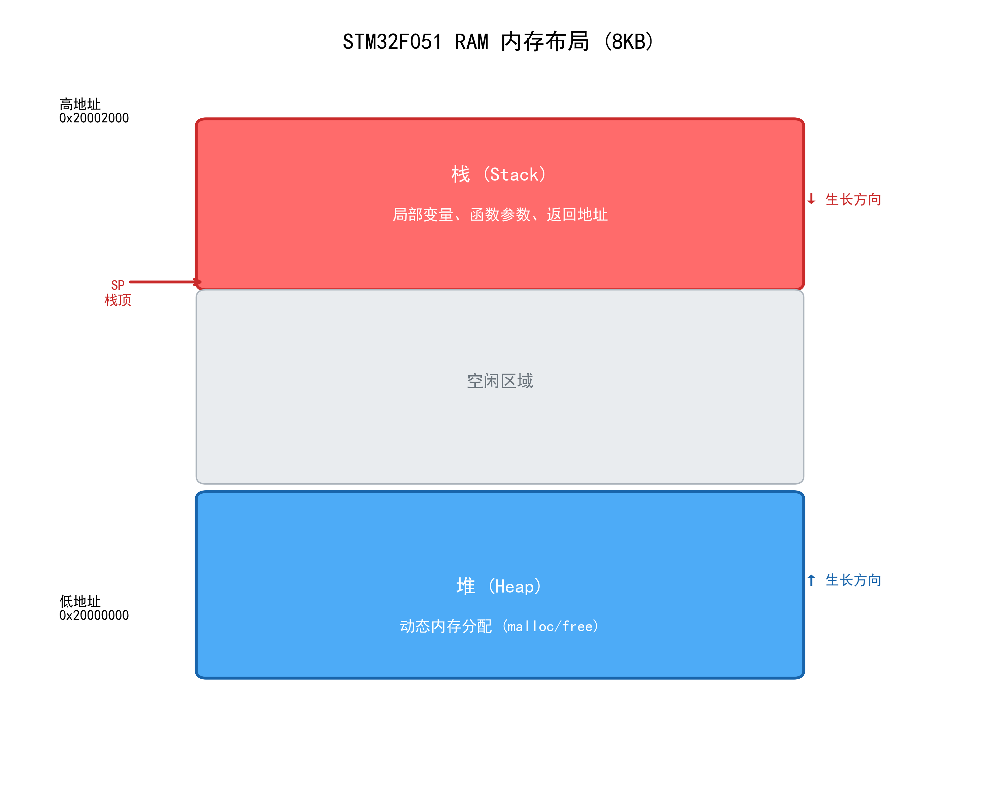
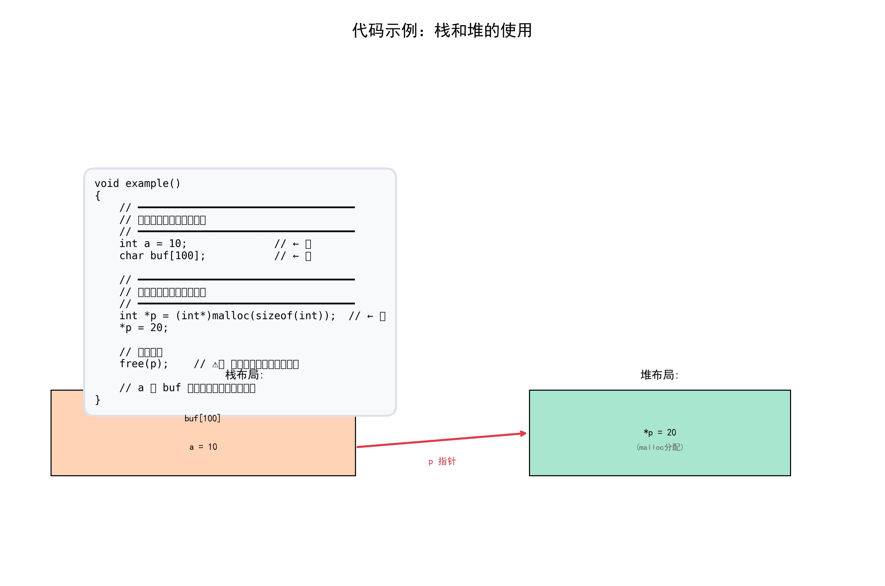
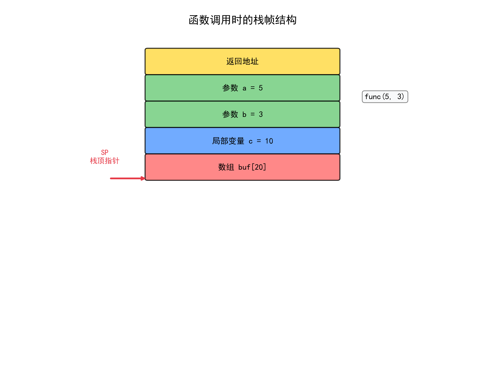
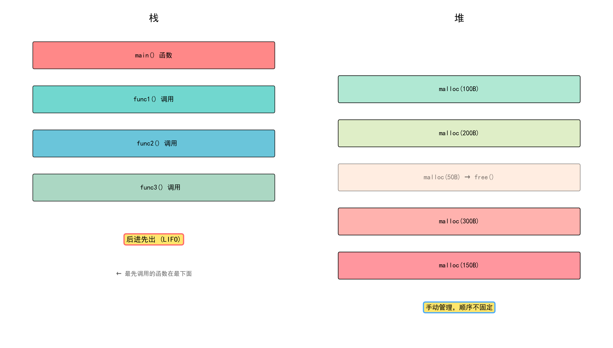
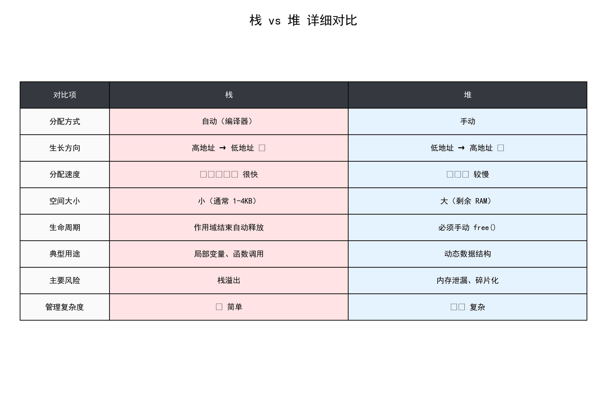
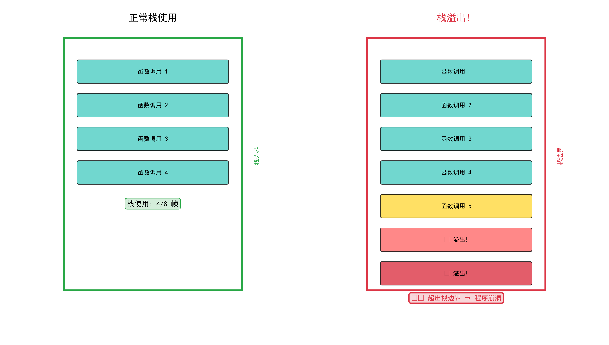

# STM32 堆栈详解

> 完整理解嵌入式系统中的内存管理

---

## 目录

1. [什么是堆和栈](#1-什么是堆和栈)
2. [内存布局](#2-内存布局)
3. [栈详解](#3-栈详解)
4. [堆详解](#4-堆详解)
5. [栈帧结构](#5-栈帧结构)
6. [堆栈对比](#6-堆栈对比)
7. [常见问题](#7-常见问题)
8. [嵌入式开发建议](#8-嵌入式开发建议)

---

## 1. 什么是堆和栈

### 1.1 简单理解

```
栈 = 自动售货机
├─ 投币就出货（自动管理）
├─ 容量有限
└─ 快速方便

堆 = 仓库租赁
├─ 自己租、自己还（手动管理）
├─ 空间很大
└─ 麻烦但灵活
```

### 1.2 专业定义

| 类型 | 全称 | 英文 | 特性 |
|------|------|------|------|
| **栈** | - | Stack | 自动管理，LIFO（后进先出） |
| **堆** | - | Heap | 手动管理，自由分配 |

---

## 2. 内存布局

### 2.1 STM32F051 RAM 结构



STM32F051 有 **8KB RAM**，从 `0x20000000` 到 `0x20002000`。

```
┌─────────────────────────────────────────────────────┐
│                   STM32F051 RAM (8KB)                │
├─────────────────────────────────────────────────────┤
│                                                     │
│   ↓ 高地址 (0x20002000)                             │
│   ┌──────────────────────────────────────────────┐ │
│   │              栈          │ │ │ ← 从高地址向低地址生长
│   │   - 局部变量                                   │ │
│   │   - 函数参数                                   │ │
│   │   - 返回地址                                   │ │
│   └──────────────────────────────────────────────┘ │
│                      ↑                             │
│   ┌──────────────────────────────────────────────┐ │
│   │              空闲区域                          │ │
│   └──────────────────────────────────────────────┘ │
│                      ↓                             │
│   ┌──────────────────────────────────────────────┐ │
│   │              堆        │ │ │ ← 从低地址向高地址生长
│   │   - malloc/free 分配的内存                    │ │
│   └──────────────────────────────────────────────┘ │
│                                                     │
│   ↑ 低地址 (0x20000000)                            │
└─────────────────────────────────────────────────────┘
```

### 2.2 生长方向对比

| 类型 | 生长方向 | 原因 |
|------|----------|------|
| **栈** | 高地址 → 低地址 ⬇ | 方便函数调用时分配 |
| **堆** | 低地址 → 高地址 ⬆ | 避免与栈冲突 |

---

## 3. 栈详解

### 3.1 栈的特点

- ✅ **自动管理**：编译器自动处理分配和释放
- ✅ **速度快**：CPU 有专门的栈指针寄存器（SP）
- ✅ **后进先出 (LIFO)**：像叠盘子一样
- ⚠️ **空间有限**：通常只有 1-4KB

### 3.2 栈存储什么？

```c
void example_function(int param1, int param2)  // 参数存在栈上
{
    int local_var = 10;                         // 局部变量存在栈上
    char buffer[100];                           // 数组存在栈上

    if (param1 > 0) {
        int temp = 20;                          // 临时变量也存栈上
    }
    // 离开 if 作用域，temp 自动释放
}
// 函数结束，param1, param2, local_var, buffer 全部自动释放
```

### 3.3 栈的函数调用过程

```c
void func_B() {
    int x = 30;
}

void func_A() {
    int y = 20;
    func_B();  // 调用 func_B
}

int main() {
    int z = 10;
    func_A();  // 调用 func_A
    return 0;
}
```

**栈的变化过程：**

```
调用 main() 后：
┌─────────────────────┐
│ z = 10              │ ← 栈顶
└─────────────────────┘

调用 func_A() 后：
┌─────────────────────┐
│ z = 10              │
├─────────────────────┤
│ 返回地址 (main)     │
├─────────────────────┤
│ y = 20              │ ← 栈顶
└─────────────────────┘

调用 func_B() 后：
┌─────────────────────┐
│ z = 10              │
├─────────────────────┤
│ 返回地址 (main)     │
├─────────────────────┤
│ y = 20              │
├─────────────────────┤
│ 返回地址 (func_A)   │
├─────────────────────┤
│ x = 30              │ ← 栈顶
└─────────────────────┘

func_B() 返回后：
┌─────────────────────┐
│ z = 10              │
├─────────────────────┤
│ 返回地址 (main)     │
├─────────────────────┤
│ y = 20              │ ← 栈顶
└─────────────────────┘
```

---

## 4. 堆详解

### 4.1 堆的特点

- ⚠️ **手动管理**：需要 malloc/free 配对使用
- ⚠️ **速度较慢**：需要内存管理算法
- ✅ **空间大**：可以使用几乎全部剩余 RAM
- ⚠️ **风险高**：容易内存泄漏或碎片化

### 4.2 堆的使用示例

```c
#include <stdlib.h>

void heap_example()
{
    // ━━━━━━━━━━━━━━━━━━━━━━━━━━━━━━━━━━━
    // 堆上的变量（手动管理）
    // ━━━━━━━━━━━━━━━━━━━━━━━━━━━━━━━━━━━

    // 在堆上分配一个整数 (4 字节)
    int *p = (int*)malloc(sizeof(int));
    *p = 20;

    // 在堆上分配一个数组 (100 字节)
    char *buffer = (char*)malloc(100);

    // 使用内存...
    buffer[0] = 'A';

    // ━━━━━━━━━━━━━━━━━━━━━━━━━━━━━━━━━━━
    // 必须手动释放！
    // ━━━━━━━━━━━━━━━━━━━━━━━━━━━━━━━━━━━
    free(p);        // 释放 p 指向的内存
    free(buffer);   // 释放 buffer 指向的内存
}
```

### 4.3 栈和堆的代码对比



```c
void example()
{
    // 栈上的变量（自动管理）
    int a = 10;              // ← 栈
    char buf[100];           // ← 栈

    // 堆上的变量（手动管理）
    int *p = (int*)malloc(sizeof(int));  // ← 堆
    *p = 20;

    // 使用完毕
    free(p);    // ⚠️ 必须释放！否则内存泄漏

    // a 和 buf 自动释放，无需手动处理
}
```

---

## 5. 栈帧结构

### 5.1 什么是栈帧？

每次函数调用时，都会在栈上分配一块连续空间，称为**栈帧（Stack Frame）**。

### 5.2 栈帧的内容



调用 `func(5, 3)` 后的栈帧：

```
┌─────────────────────────────────────┐
│      ... (之前的栈帧)                │
├─────────────────────────────────────┤
│      返回地址                        │ ← func 返回后跳转的位置
├─────────────────────────────────────┤
│      参数 a = 5                      │
├─────────────────────────────────────┤
│      参数 b = 3                      │
├─────────────────────────────────────┤
│      局部变量 c = 10                 │
├─────────────────────────────────────┤
│      数组 buf[20]                    │
└─────────────────────────────────────┘
      ↑ 栈顶指针 (SP)
```

### 5.3 完整的函数调用流程

```c
int add(int a, int b) {
    int result = a + b;
    return result;
}

int main() {
    int sum = add(3, 5);
    return 0;
}
```

**调用 add(3, 5) 时栈的变化：**

```
1. 调用前：
   ┌──────────┐
   │ main 的  │
   │ 局部变量 │
   └──────────┘
     ↑ SP

2. 压入参数：
   ┌──────────┐
   │ main 的  │
   │ 局部变量 │
   ├──────────┤
   │   3      │ ← 参数 a
   ├──────────┤
   │   5      │ ← 参数 b
   └──────────┘
     ↑ SP

3. 压入返回地址：
   ┌──────────┐
   │ main 的  │
   │ 局部变量 │
   ├──────────┤
   │   3      │
   ├──────────┤
   │   5      │
   ├──────────┤
   │ 返回地址 │
   └──────────┘
     ↑ SP

4. 分配局部变量：
   ┌──────────┐
   │ main 的  │
   │ 局部变量 │
   ├──────────┤
   │   3      │
   ├──────────┤
   │   5      │
   ├──────────┤
   │ 返回地址 │
   ├──────────┤
   │ result=8│ ← 局部变量
   └──────────┘
     ↑ SP
```

---

## 6. 堆栈对比

### 6.1 可视化对比



### 6.2 详细对比表



| 对比项 | 栈 (Stack) | 堆 (Heap) |
|--------|-----------|----------|
| **分配方式** | 自动（编译器） | 手动 |
| **生长方向** | 高地址 → 低地址 ⬇ | 低地址 → 高地址 ⬆ |
| **分配速度** | ⭐⭐⭐⭐⭐ 很快 | ⭐⭐⭐ 较慢 |
| **空间大小** | 小（通常 1-4KB） | 大（剩余 RAM） |
| **生命周期** | 作用域结束自动释放 | 必须手动 free() |
| **典型用途** | 局部变量、函数调用 | 动态数据结构 |
| **主要风险** | 栈溢出 | 内存泄漏、碎片化 |
| **管理复杂度** | ✓ 简单 | ⚠️ 复杂 |
| **典型大小** | 1-4KB | 取决于 RAM 大小 |
| **分配单位** | 自动 | 字节 |

### 6.3 何时使用哪个？

```
┌─────────────────────────────────────────────────────┐
│              决策树：我应该用栈还是堆？              │
├─────────────────────────────────────────────────────┤
│                                                     │
│  变量大小确定且较小（< 1KB）？                      │
│         │                                           │
│         ├─ 是 → 用栈（局部变量）                    │
│         │                                           │
│         └─ 否 → 是否需要动态调整大小？              │
│                  │                                  │
│                  ├─ 是 → 用堆（malloc）             │
│                  │                                  │
│                  └─ 否 → 考虑全局变量               │
│                                                     │
└─────────────────────────────────────────────────────┘
```

---

## 7. 常见问题

### 7.1 栈溢出 (Stack Overflow)

#### 什么是栈溢出？

当栈使用超过其分配的大小时，会发生栈溢出。



#### 栈溢出的原因

1. **递归太深**
```c
// 危险！可能栈溢出
void infinite_recursion(int n) {
    int local_array[100];  // 每次调用占用 400 字节
    infinite_recursion(n + 1);
}
```

2. **局部数组过大**
```c
// 危险！可能栈溢出
void dangerous() {
    char huge_buffer[10000];  // 超过栈大小
}
```

3. **函数调用层次过深**

#### 如何避免栈溢出？

```c
// 方案 1：增大栈大小
// 修改 startup_stm32f051.s 中的 Stack_Size
Stack_Size EQU 0x00002000     // 改为 8KB

// 方案 2：使用全局变量
int big_array[5000];          // 不在栈上

// 方案 3：使用堆（谨慎）
int *p = malloc(5000 * sizeof(int));
// ... 使用 ...
free(p);
```

### 7.2 内存泄漏 (Memory Leak)

#### 什么是内存泄漏？

分配了堆内存但没有释放，导致可用内存越来越少。

```c
// ❌ 内存泄漏！
void leak_example() {
    int *p = (int*)malloc(100);
    *p = 10;
    // 忘记 free(p)！
}

// ✓ 正确的做法
void correct_example() {
    int *p = (int*)malloc(100);
    *p = 10;
    free(p);  // 释放内存
}
```

#### 如何避免内存泄漏？

1. ** malloc 和 free 配对使用**
2. **使用内存检测工具**
3. **建立良好的编程习惯**
4. **在嵌入式系统中尽量避免使用堆**

### 7.3 野指针 (Dangling Pointer)

```c
// ❌ 野指针示例
int *p = (int*)malloc(sizeof(int));
free(p);
*p = 10;  // 错误！p 指向的内存已被释放

// ✓ 正确的做法
int *p = (int*)malloc(sizeof(int));
*p = 10;
free(p);
p = NULL;  // 避免野指针
```

---

## 8. 嵌入式开发建议

### 8.1 嵌入式系统的特殊性

嵌入式系统与 PC 软件不同：

| 特点 | PC 软件 | 嵌入式系统 |
|------|---------|-----------|
| **RAM 大小** | GB 级别 | KB 级别 |
| **是否使用堆** | 常用 | 尽量避免 |
| **后果** | 可重启 | 系统死机 |
| **调试难度** | 简单 | 困难 |

### 8.2 嵌入式开发最佳实践

#### 1. 优先使用栈

```c
// ✓ 推荐：使用栈
void good_example() {
    int buffer[100];  // 在栈上
    // 使用 buffer
}
// 自动释放，无需担心
```

#### 2. 避免动态内存分配

```c
// ⚠️ 不推荐：使用堆
void risky_example() {
    int *p = (int*)malloc(100);
    // 如果忘记 free，会内存泄漏
}

// ✓ 推荐：使用全局变量或静态变量
static int buffer[100];  // 在静态存储区
```

#### 3. 大数组使用全局变量

```c
// ✓ 推荐
int large_data[5000];  // 全局数组，不占栈

void process() {
    // 使用 large_data
}
```

#### 4. 谨慎使用递归

```c
// ⚠️ 不推荐：递归可能导致栈溢出
int factorial(int n) {
    if (n <= 1) return 1;
    return n * factorial(n - 1);  // 递归
}

// ✓ 推荐：使用循环
int factorial(int n) {
    int result = 1;
    for (int i = 2; i <= n; i++) {
        result *= i;
    }
    return result;
}
```

### 8.3 调整栈大小

如果确实需要更大的栈，修改启动文件：

**文件位置**：`CMSIS/STM32F0xx/Source/Templates/arm/startup_stm32f051.s`

```asm
; 修改栈大小（默认 1KB）
Stack_Size      EQU     0x00000400     ; 1KB
; 改为
Stack_Size      EQU     0x00001000     ; 4KB
```

---

## 9. 总结

### 9.1 核心要点

```
┌─────────────────────────────────────────────────────┐
│                    核心总结                          │
├─────────────────────────────────────────────────────┤
│                                                     │
│  1. 栈：自动管理，速度快，空间小，用于局部变量       │
│                                                     │
│  2. 堆：手动管理，空间大，速度慢，用于动态分配       │
│                                                     │
│  3. 嵌入式系统：优先用栈，避免用堆                   │
│                                                     │
│  4. 栈溢出：递归太深、局部数组过大                   │
│                                                     │
│  5. 内存泄漏：malloc 后忘记 free                    │
│                                                     │
└─────────────────────────────────────────────────────┘
```

### 9.2 快速参考

| 场景 | 使用方式 |
|------|---------|
| 小型局部变量 | 栈（局部变量） |
| 大型数组 | 全局变量 |
| 动态大小数据结构 | 堆（谨慎使用） |
| 递归函数 | 改为循环（或增大栈） |
| 嵌入式系统 | 尽量不用堆 |

---

## 附录

### A. 修改栈大小的步骤

1. 打开 `CMSIS/STM32F0xx/Source/Templates/arm/startup_stm32f051.s`
2. 找到 `Stack_Size` 定义
3. 修改数值（例如 `0x00001000` = 4KB）
4. 重新编译

### B. 常用内存管理函数

```c
#include <stdlib.h>

// 分配内存
void *malloc(size_t size);
void *calloc(size_t count, size_t size);

// 重新分配
void *realloc(void *ptr, size_t size);

// 释放内存
void free(void *ptr);
```

### C. 检测栈使用情况

```c
// 在启动文件中定义的特殊变量
extern uint32_t _estack;    // 栈顶地址
extern uint32_t _sstack;    // 栈底地址

// 运行时检查栈使用
uint32_t stack_used = _estack - (uint32_t)__get_MSP();
uint32_t stack_total = _estack - _sstack;
```

---

**文档版本**：v1.0
**最后更新**：2026-01-12
**适用芯片**：STM32F0xx 系列
